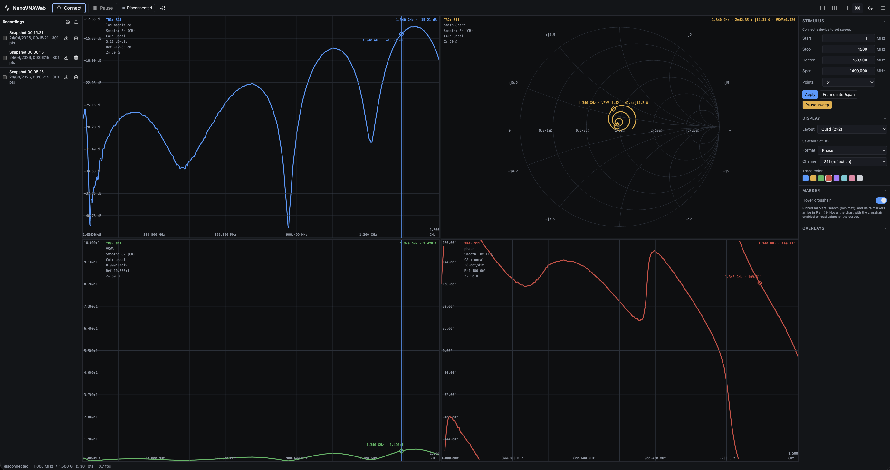

# NanoVNAWeb

A browser-based control and measurement application for NanoVNA vector
network analyzers.

Plug your VNA into a USB port, open the page in Chrome or Edge, click
**Connect**, and the sweep starts. No installer, no native USB driver,
no compiled desktop binary — the app talks to the device directly over
the [Web Serial API] and renders S-parameter sweeps in real time on a
GPU-accelerated canvas.

[Web Serial API]: https://developer.mozilla.org/docs/Web/API/Web_Serial_API

<p align="center">
  <a href="docs/screenshots/nanoVNAWeb.png">
    
  </a>
</p>

<p align="center"><sub><i>Click for full resolution.</i></sub></p>

> **Status:** version **0.1** — early but functional. APIs may change
> without notice while the project stabilises against real hardware.

## Features

- **Live measurement** — single-shot or continuous streaming sweep
  against the connected device.
- **Five chart kinds** — log-magnitude (dB), linear magnitude, Smith
  chart, VSWR, phase, and group delay. Each runs on its own
  GPU-accelerated regl pipeline with Catmull-Rom trace smoothing.
- **Quad / pair / single layouts** — drag-resizable chart slots,
  configurable per slot
  ([`apps/web/src/layout/ChartGrid.tsx`](apps/web/src/layout/ChartGrid.tsx)).
- **Synchronized cursor** — hovering any chart sets a shared frequency;
  every other chart draws its own per-trace marker at that frequency in
  the trace's own colour, with the readout label routed to whichever
  curve the pointer is closest to
  ([`apps/web/src/charts/HoverCrosshair.tsx`](apps/web/src/charts/HoverCrosshair.tsx)).
- **Touchstone I/O** — import `.s1p` / `.s2p` files as overlay traces
  and export the live sweep
  ([`packages/formats/src/touchstone/`](packages/formats/src/touchstone/)).
- **Persistent stimulus** — start / stop / points are remembered across
  sessions in `localStorage` so narrow-band setups survive a reload.
- **PWA install** — installable as a standalone app, with offline shell
  caching and an in-app update prompt.
- **Keyboard shortcuts** — capture, stream, sweep presets
  ([`apps/web/src/shortcuts`](apps/web/src/shortcuts)).
- **Docker-deployable** — single `docker compose up` serves the built
  SPA behind nginx; see [Deployment](#deployment).

## Browser support

The app requires the **Web Serial API**, currently shipped only by
Chromium-based browsers (Chrome / Edge / Brave / Opera ≥ 89). Firefox
and Safari do not implement Web Serial as of this writing — the charts
render fine, but the **Connect** button has nothing to call.

Web Serial is also restricted to **secure contexts**:

- `http://localhost` — works (browser treats it as secure).
- `https://your.host` — works.
- `http://192.168.x.y` — does **not** work; the Connect button is inert.

For LAN / remote deployments, terminate TLS at a reverse proxy in front
of the container.

## Hardware support

| Board                 | Driver location                                                          |
|-----------------------|--------------------------------------------------------------------------|
| NanoVNA V1            | [`packages/protocol/src/v1`](packages/protocol/src/v1)                   |
| NanoVNA-F             | V1 driver + auto-detected capabilities                                   |
| NanoVNA V2 / V2 Plus  | [`packages/protocol/src/v2`](packages/protocol/src/v2)                   |
| NanoVNA F V2 / F V3   | V2 driver + cap override                                                 |

Detected capabilities (frequency range, max points) flow from the device
into the Stimulus form via the connection store. If the auto-detected
profile is wrong for your board, the **Device Capability Override** in
the Connect panel lets you adjust it manually. The current V2 hardware
matrix lives in [`docs/v2-hardware-validation.md`](docs/v2-hardware-validation.md).

## Quick start

### 1. Run from the published image (Portainer / one-host)

A multi-arch image (`linux/amd64` + `linux/arm64`) is published to GHCR
on every push to `main` and every `v*` tag:

```
ghcr.io/techniker/nanovnaweb:latest
```

#### Plain `docker run`

```bash
docker run -d --name nanovnaweb -p 8080:80 ghcr.io/techniker/nanovnaweb:latest
# open http://localhost:8080
```

#### Plain `docker compose` (no source checkout needed)

Drop the snippet below into a `docker-compose.yml` on your host and run
`docker compose up -d`. It is the same content as
[`docker/portainer-stack.yml`](docker/portainer-stack.yml) in this
repository.

```yaml
services:
  web:
    image: ghcr.io/techniker/nanovnaweb:latest
    container_name: nanovnaweb
    restart: unless-stopped
    ports:
      - "${NVW_PORT:-8080}:80"
    healthcheck:
      test: ["CMD", "wget", "-qO-", "http://127.0.0.1/healthz"]
      interval: 30s
      timeout: 3s
      retries: 3
      start_period: 5s
    read_only: true
    tmpfs:
      - /var/cache/nginx
      - /var/run
    cap_drop:
      - ALL
    cap_add:
      - CHOWN
      - SETGID
      - SETUID
      - NET_BIND_SERVICE
    security_opt:
      - no-new-privileges:true
```

#### Portainer (Web editor)

1. **Stacks** → **Add stack**.
2. Give it a name (e.g. `nanovnaweb`) and pick **Web editor**.
3. Paste the YAML above (or the contents of
   [`docker/portainer-stack.yml`](docker/portainer-stack.yml)).
4. *Optional:* under **Environment variables**, add `NVW_PORT` to
   override the host port (default `8080`).
5. Click **Deploy the stack** and open `http://<host>:8080/`.

No source checkout, no build step on the host — Portainer pulls the
image straight from GHCR and starts the container. Updates are a
single **Pull and redeploy** click in the same Stacks UI.

> **Secure context required.** Web Serial only works on
> `http://localhost` or `https://your.host`. On a LAN IP
> (`http://192.168.x.y`) the *Connect* button is inert. For remote
> access put the container behind a TLS-terminating reverse proxy
> (Traefik, Caddy, nginx-proxy, …).

### 2. Run via Docker Compose from source (production)

```bash
git clone https://github.com/techniker/nanoVNAWeb.git nanovnaweb && cd nanovnaweb
docker compose up -d --build
# open http://localhost:8080
```

The compose stack is a single hardened nginx container serving the
prebuilt SPA. Override the host port with `NVW_PORT=…`:

```bash
NVW_PORT=3000 docker compose up -d --build
```

### 3. Run the dev server

```bash
pnpm install
pnpm --filter @nanovnaweb/web dev
# open http://localhost:5173
```

Hot-module reload, source maps, full DevTools.

### 4. Build a static bundle

```bash
pnpm install
pnpm build                              # build workspace packages first
pnpm --filter @nanovnaweb/web build     # then the web app
# output is in apps/web/dist
```

The `dist/` folder is a fully static SPA — drop it on any HTTPS-capable
static host (S3 + CloudFront, Caddy, GitHub Pages with HTTPS, …).

## Requirements

- **Node.js 20 LTS** (see `.nvmrc` and the `engines` field in
  [`package.json`](package.json)).
- **pnpm 9.12** — `corepack enable` will activate it from the Node
  distribution; the exact version is pinned in `packageManager`.
- A **Chromium-based browser** (Chrome, Edge, Brave, Opera ≥ 89) for
  Web Serial.
- **Docker** ≥ 24 with Compose v2 if you want the container path.

## Deployment

For most self-hosters the easiest path is the **published GHCR image**
(see [Quick start §1](#1-run-from-the-published-image-portainer--one-host)).
The repo also ships a multi-stage [Dockerfile](Dockerfile) and a
hardened [`docker-compose.yml`](docker-compose.yml) for building from
source:

- **Build stage** — `node:20.11-alpine` + corepack-pinned pnpm 9.12;
  builds workspace packages and the Vite bundle with a BuildKit cache
  mount on the pnpm store.
- **Runtime stage** — `nginx:1.27-alpine` with a tailored
  [`docker/nginx.conf`](docker/nginx.conf): SPA fallback, immutable 1y
  cache on `/assets/*`, no-cache on `sw.js` / `manifest.webmanifest`
  (so PWA updates can never get trapped behind a stale service worker),
  gzip for text assets, sane security headers, and a `/healthz` probe.
- **Hardening** — `read_only: true`, `cap_drop: ALL` plus only the caps
  nginx needs to bind :80 and drop privileges, `no-new-privileges`, and
  `tmpfs` for the few writable paths nginx needs at runtime.
- **Multi-arch publish** — [`.github/workflows/docker-publish.yml`](.github/workflows/docker-publish.yml)
  builds `linux/amd64` + `linux/arm64` on every push to `main` and
  every `v*` tag, pushing to `ghcr.io/techniker/nanovnaweb`.

For HTTPS, sit the container behind a reverse proxy (Traefik, Caddy,
nginx-proxy, …) — Web Serial requires it for any non-localhost host.

## Repository layout

NanoVNAWeb is a pnpm-workspace monorepo. The split exists so the non-UI
packages stay testable in pure Node / vitest with no DOM:

```
.
├── apps/
│   └── web/                Vite + React 19 + Tailwind 4 SPA
├── packages/
│   ├── shared/             Pure types + utilities (Hz, Result, units, logger, …)
│   ├── device/             Web Serial transport + fake transport for tests
│   ├── protocol/           Per-board drivers (V1, V2) + driver registry
│   ├── formats/            Touchstone reader / writer / codec
│   ├── render/             regl chart renderers + Smith / phase / VSWR / group-delay math
│   ├── state/              Zustand stores (connection, sweep, trace, chart, mode, debug)
│   ├── persistence/        IndexedDB-backed trace repository
│   └── workers/            Off-main-thread IO façade (Comlink)
└── tooling/
    ├── biome/              Shared lint / format config
    ├── tsconfig/           Shared tsconfig.base.json
    ├── tailwind-config/    Shared design tokens
    └── vitest/             Shared test config
```

## Development

Common commands from the repo root:

```bash
pnpm install           # bootstrap the workspace
pnpm build             # build workspace packages + tooling
pnpm test              # run the full vitest suite
pnpm test:watch        # vitest in watch mode
pnpm typecheck         # parallel `tsc --noEmit` across every workspace
pnpm lint              # biome check
pnpm lint:fix          # biome auto-fix
pnpm format            # biome format
pnpm clean             # remove every dist/ and the Vite cache
```

Pre-commit hooks (lefthook) run biome and typecheck on every commit;
commit messages are validated against Conventional Commits via
commitlint.

## Architecture notes

A few decisions worth knowing if you plan to contribute:

- **Single source of truth for chart Y-ranges.** `resolveYRange(kind,
  values, opts)` in
  [`packages/render/src/math/transforms.ts`](packages/render/src/math/transforms.ts)
  is called by both the regl renderer (for the trace + grid) and the
  DOM overlays (for tick labels, Ref readout, hover marker). Any rule
  change — user-configurable VSWR scale, adaptive phase scale —
  propagates atomically across every layer.
- **Non-blocking by invariant.** Long / heavy work (parsing Touchstone,
  IndexedDB, sweep IO) runs off the main thread; renderers are pure
  GPU pipelines. The repo treats sync I/O on the main thread as a bug.
- **Group delay wraps phase deltas.** atan2 outputs in (−π, π], so any
  resonance crossing ±180° produces an artificial 2π jump in the raw
  phase difference. `computeGroupDelay`
  ([`packages/render/src/math/group-delay.ts`](packages/render/src/math/group-delay.ts))
  wraps Δφ into [−π, π] via `Δφ − 2π·round(Δφ/2π)` before
  differentiating, which collapses the wrap without losing precision
  on small linear-phase steps.

## Contributing

- Development branch: `dev`. All work lands there; `main` tracks
  releases.
- Conventional commits (`feat(scope): …`, `fix(scope): …`, `chore: …`,
  `test: …`, `docs: …`).
- Pre-commit hooks run Biome and `tsc` via lefthook; commit messages
  are validated by commitlint.
- Tests are required for core packages (TDD where practical).

## License

NanoVNAWeb is free software: you can redistribute it and / or modify it
under the terms of the **GNU General Public License** as published by
the Free Software Foundation, either **version 3 of the License, or
(at your option) any later version**
([`SPDX: GPL-3.0-or-later`](https://spdx.org/licenses/GPL-3.0-or-later.html)).

NanoVNAWeb is distributed in the hope that it will be useful, but
**without any warranty**; without even the implied warranty of
merchantability or fitness for a particular purpose. See the GNU
General Public License for more details.

The full license text is in [`LICENSE`](LICENSE) at the repository
root. A copy is also available at <https://www.gnu.org/licenses/gpl-3.0.html>.

Copyright © 2026 Bjoern Heller (tec [at] sixtopia [dot] net), Sixtopia.net.

By submitting a contribution to this project (e.g. via pull request) you
agree to license your contribution under the same GPL-3.0-or-later terms
as the rest of the project.
